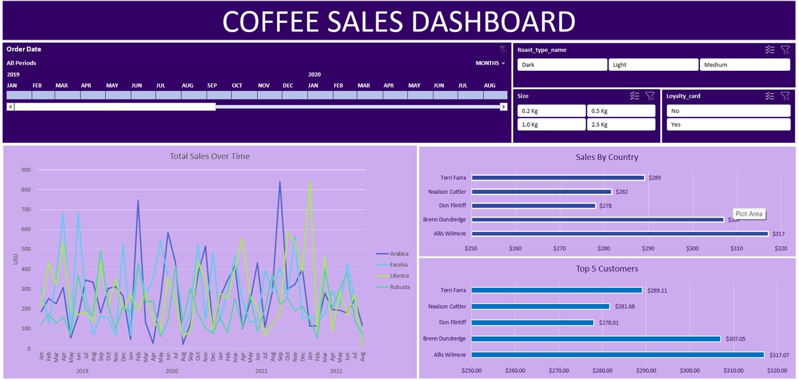

# ☕ Coffee Sales Dashboard

An interactive Power BI dashboard created to analyze coffee sales performance, customer behavior, and product trends. Inspired by a [YouTube tutorial](https://youtu.be/m13o5aqeCbM?si=yRj2VWCTpB9RSvZ7), this project goes beyond visualization—focusing on **data storytelling** and delivering **business insights**.

---

## 🖼️ Dashboard Preview

## 🎯 Objective

To transform raw transactional data into a visually compelling dashboard that helps answer:
- Which coffee types and roast levels perform best?
- How do customer purchase behaviors differ by loyalty and size?
- Who are the top customers and which regions drive sales?
- What sales trends emerge across time?

---

## 📊 Key Metrics Analyzed

- **Total Sales (USD)**
- **Monthly Sales Trends** (by coffee type)
- **Sales by Country**
- **Top 5 Customers by Revenue**
- **Average Order Value**
- **Quantity Purchased**
- **Loyalty Card Customer Revenue**

---

## 🧭 Key Dimensions Explored

- `Order Date` (Monthly trend)
- `Roast Type` (Dark, Medium, Light)
- `Coffee Type` (Arabica, Robusta, Excelsa, Liberica)
- `Size` (0.2kg, 0.5kg, 1kg, 2.5kg)
- `Country`
- `Customer Name`
- `Loyalty Card` (Yes/No)

---

## 📈 Dashboard Highlights

### 1. Total Sales Over Time
- Time series line chart showing performance of each coffee variety.
- Seasonal peaks in late Q4 and mid-Q2 suggest strong holiday and summer demand.

### 2. Sales by Country
- Horizontal bar chart displaying regional performance.
- Insight into which countries are high-performing markets.

### 3. Top 5 Customers
- Ranked bar chart with total revenue per customer.
- Identifies key clients contributing significantly to the bottom line.

### 4. Slicers for Deep Dive
- Filter views by roast type, loyalty card, size, and time frame.
- Designed for marketing, operations, and sales teams to explore on-demand insights.

---

## 🔍 Business Insights

- **Arabica and Robusta dominate sales**, with recurring seasonal spikes.
- **Loyalty card holders show higher basket sizes and purchase frequency**.
- Top customers can be targeted for retention or upselling campaigns.
- Early 2020 sales dip likely reflects external global market disruptions.

---

## 💡 Future Enhancements

- Integrate **profit margin analysis** per SKU and country
- Build **forecasting models** (ARIMA/ETS) for future sales predictions
- Use **RFM segmentation** for customer lifetime value insights
- Add **marketing campaign performance** if source data is available

---

## 🛠 Tools Used

- **Power BI** – for interactive dashboards and data modeling
- **Excel** – for cleaning and shaping initial raw data

---

## 📎 Files Included

- `coffeeOrdersData.xlsx` – cleaned dataset used
- `coffesalesdashboard.jpg` – dashboard screenshot
- `.pbix` file – not uploaded here due to size (available on request)

---

## 📬 Feedback

Open to feedback, improvements, and collaboration ideas!  
Feel free to connect with me on [LinkedIn](#) or raise an issue here.

📽️ **Video Credit**: [Original YouTube Tutorial](https://youtu.be/m13o5aqeCbM?si=yRj2VWCTpB9RSvZ7)
